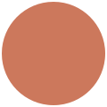

<p align="center">
  
</p>

<h1 align="center">KNA Agent</h1>

<p align="center">
  <strong>用人民币驱动 Claude · 中国大陆开发者的桌面 AI 助手</strong>
</p>

<p align="center">
  免 CLI · 中文优先 · 引流期官方价 <strong>1.5 折</strong>计费 · 跨境电商 / 内容创作 / 数据分析场景包内置
</p>

<p align="center">
  
  
  
</p>

---

## 这是什么

KNA Agent 是 KNA（[wearekna.com](https://wearekna.com)）面向**中国大陆开发者和 SMB 用户**的桌面 Claude 助手。基于开源 [ClawX](https://github.com/ValueCell-ai/ClawX) (MIT) 二次开发，预置中国大陆友好的全套配置：

- **API 中转预设**：默认 provider 指向 `https://code.wearekna.com`，免去 `ANTHROPIC_BASE_URL` 配置；引流期所有模型按 Anthropic 官方价 **1.5 折**计费（实付仅官方 15%）
- **中文优先 UI**：默认中文界面、中文 skill 文档、中文 setup wizard、中文客服 (`info@wearekna.com`)
- **无 CLI 门槛**：图形化管理 provider、skill、定时任务、对话历史
- **国产 IM 集成**：内置微信 / 飞书 / 钉钉 channel 插件
- **跨境电商场景包**：Shopify listing 写作 / Amazon 翻译 / 拼多多 SKU / 小红书种草 / 公众号文案（开发中）

## 谁应该用

- 跨境电商运营 / 独立站站长
- 内容创作团队（小红书、抖音、公众号）
- 不想折腾 `ANTHROPIC_BASE_URL` 的 Claude 用户
- 喜欢按量付费、人民币结算、余额永不过期的开发者

## 准备工作

1. 在 [code.wearekna.com/register](https://code.wearekna.com/register) 注册 KNA 账号
2. 控制台 → API Keys → 新建一个 `sk-` 开头的 Key
3. 充值 ¥30 起（注册即送 100 万 Sonnet 4.6 token，可先试用）
4. 下载 KNA Agent（见下方 Release 页）→ 启动 → 选 "KNA" provider → 粘贴 Key → 开聊

## 平台支持

- macOS 11+（Apple Silicon + Intel）
- Windows 10/11
- Linux（Ubuntu 20.04+）

## 开发

```bash
pnpm install
pnpm dev          # 启动 vite 开发服务器
pnpm typecheck    # TypeScript 检查
pnpm test         # 单元测试
pnpm package:mac:local   # 构建 Mac dmg（本地未签名）
pnpm package:win         # 构建 Windows MSI
pnpm package:linux       # 构建 Linux AppImage/deb/rpm
```

## 与上游 ClawX 的关系

KNA Agent 是 ClawX 的友好 fork。我们：
- 保留 ClawX 的核心架构（Electron + React + Zustand + OpenClaw runtime）
- 加 KNA provider + 中国大陆默认配置
- 加跨境电商场景 skill 包
- 暂未推送上游（场景过于垂直）

对 ClawX / OpenClaw 团队致以诚挚的谢意 — 没有他们就没有这个项目。

## 协议

MIT License — 同上游 ClawX。

## 联系

- 官网：[wearekna.com](https://wearekna.com)
- 控制台：[code.wearekna.com](https://code.wearekna.com)
- 网页聊天：[chat.wearekna.com](https://chat.wearekna.com)
- 邮箱：[info@wearekna.com](mailto:info@wearekna.com)

---

🥃 _KNA — 独立运营，与 Anthropic 无隶属关系。Built by developers, for developers._
